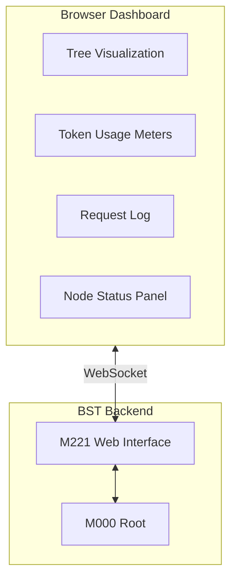
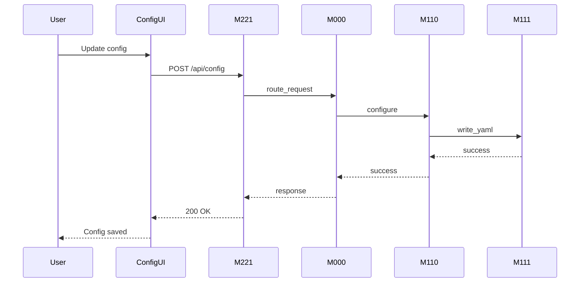
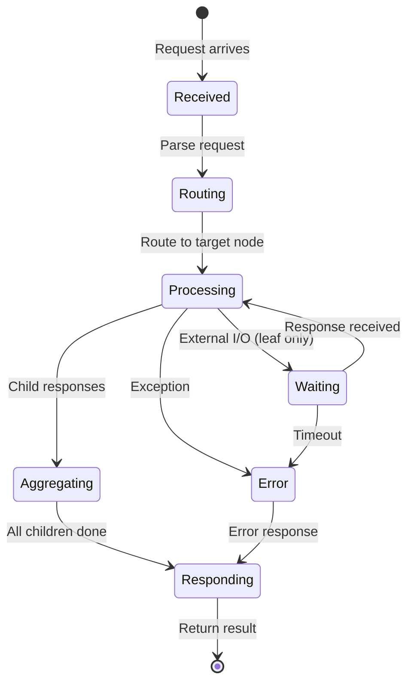
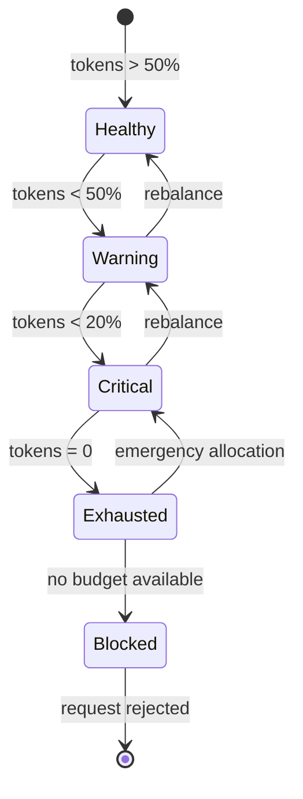

# UI/UX Documentation

## Overview

The BST Orchestration system is primarily a **backend library/framework** without a graphical user interface. This document covers:

1. Current CLI interface documentation
2. API interaction patterns
3. Proposed UI architecture for future implementation
4. How the agent orchestration maps to UI components

---

## Current Interfaces

### CLI Commands

#### Run Tests
```bash
$ python -m pytest -v
========================= test session starts ==========================
platform linux -- Python 3.11.x, pytest-7.x.x
collected 46 items

shared/tests/test_token_balancer.py::test_initial_balance PASSED    [  2%]
shared/tests/test_token_balancer.py::test_query_allocation PASSED   [  4%]
tree/M000/tests/test_m000.py::test_root_initialization PASSED       [  6%]
...
========================= 46 passed in 2.34s ===========================
```

#### Run Coverage
```bash
$ python scripts/run_coverage.py --html
Running coverage analysis...

Name                              Stmts   Miss  Cover
-----------------------------------------------------
shared/utils/token_balancer.py       45      7    84%
tree/M000/src/main.py                62      9    85%
tree/M111/src/main.py                38      4    89%
...
-----------------------------------------------------
TOTAL                               892    148    83%

HTML report generated: coverage_html/index.html
```

#### Run Linter
```bash
$ python scripts/run_linter.py
Running flake8 linter...

tree/M000/src/main.py: OK
tree/M100/src/main.py: OK
tree/M111/src/main.py: OK
...

All files passed linting (0 errors)
```

#### Run Scenarios
```bash
$ python scripts/run_scenarios.py

BST Orchestration - Scenario Simulations
=========================================

Scenario 1: Config Load
  Path: M111 → M110 → M100 → M000
  Tokens: 120
  Status: PASS

Scenario 2: Tenant Query
  Path: M122 → M120 → M100 → M000
  Tokens: 180
  Status: PASS

...

Scenario 10: Full Pipeline
  Path: M111 → M122 → M211 → M222
  Tokens: 350
  Status: PASS

=========================================
Results: 10/10 passed
Total tokens consumed: ~1,350
```

#### Run Demo
```bash
$ python scripts/demo.py

BST Orchestration Demo
======================

1. Initializing tree structure...
   [OK] Root M000 initialized
   [OK] 15 nodes connected

2. Token distribution...
   M000: 100,000 tokens (root)
   M100: 50,000 tokens
   M200: 50,000 tokens
   ...
   M222: 12,500 tokens (leaf)

3. Processing request...
   Request: {"action": "query_tenant", "id": 123}
   Route: M000 → M100 → M120 → M122
   Result: {"success": true, "data": {...}}

Demo completed successfully!
```

---

## API Interaction Patterns

### Node Communication Protocol

Each node in the BST communicates using a standardized message format:

```python
# Request format
{
    "action": str,           # Operation to perform
    "target": str,           # Optional target node/subtree
    "data": dict,            # Payload data
    "token_budget": int,     # Available tokens for operation
    "trace_id": str          # Request tracing ID
}

# Response format
{
    "success": bool,
    "data": dict,            # Result data
    "tokens_used": int,
    "path": list[str],       # Nodes traversed
    "error": str | None
}
```

### Example: Query Flow

```python
# 1. Root receives request
root.process({
    "action": "query_tenant",
    "data": {"tenant_id": 123}
})

# 2. Root routes to M100 (Infrastructure)
# 3. M100 routes to M120 (Database Handler)
# 4. M120 routes to M122 (SQL Database leaf)
# 5. M122 queries external database
# 6. Response propagates back up

# Final response at root:
{
    "success": True,
    "data": {
        "tenant_id": 123,
        "name": "John Doe",
        "unit": "A101"
    },
    "tokens_used": 180,
    "path": ["M000", "M100", "M120", "M122"]
}
```

---

## Proposed UI Architecture

### UI Component Mapping to BST Nodes

The agent orchestration system maps UI components to BST nodes as follows:

```
┌─────────────────────────────────────────────────────────────────┐
│                    Dashboard (maps to M000)                      │
│  ┌────────────────────────┬────────────────────────────────────┐│
│  │   Infrastructure       │         Application                ││
│  │   Panel (M100)         │         Panel (M200)               ││
│  │  ┌─────────┬─────────┐ │  ┌─────────┬─────────────────────┐ ││
│  │  │ Config  │ Database│ │  │ Server  │      Output         │ ││
│  │  │ (M110)  │ (M120)  │ │  │ (M210)  │      (M220)         │ ││
│  │  │┌──┬───┐ │┌──┬───┐ │ │  │┌──┬───┐ │ ┌───┬───┬───┐      │ ││
│  │  ││YA│Log│ ││Ex│SQL│ │ │  ││MC│Res│ │ │Web│PDF│   │      │ ││
│  │  ││ML│   │ ││ce│   │ │ │  ││P │   │ │ │API│Gen│   │      │ ││
│  │  │└──┴───┘ │└──┴───┘ │ │  │└──┴───┘ │ └───┴───┴───┘      │ ││
│  │  └─────────┴─────────┘ │  └─────────┴─────────────────────┘ ││
│  └────────────────────────┴────────────────────────────────────┘│
└─────────────────────────────────────────────────────────────────┘
```

### UI Implementation Plan

#### Phase 1: Monitoring Dashboard

**Agent Responsibility**: M220 (Output Handler) coordinates UI rendering via M221 (Web Interface)



**Components**:

| Component | BST Node | Responsibility |
|-----------|----------|----------------|
| Tree Visualization | M000 | Renders full tree state |
| Token Meters | M000 + TokenBalancer | Shows token distribution |
| Request Log | M112 (Log Writer) | Displays request history |
| Node Status | All nodes | Real-time health status |

#### Phase 2: Configuration Interface

**Agent Responsibility**: M110 (Config Handler) manages configuration UI



#### Phase 3: Data Management Interface

**Agent Responsibility**: M120 (Database Handler) coordinates data operations

**Wireframe**:
```
┌─────────────────────────────────────────────────────────────┐
│ Tenant Management                                    [+ Add] │
├─────────────────────────────────────────────────────────────┤
│ Search: [_______________] [Filter ▼] [Search]               │
├─────┬──────────┬──────────┬────────────┬───────────────────┤
│ ID  │ Name     │ Unit     │ Status     │ Actions           │
├─────┼──────────┼──────────┼────────────┼───────────────────┤
│ 123 │ John Doe │ A101     │ Active     │ [Edit] [Delete]   │
│ 124 │ Jane Doe │ B202     │ Active     │ [Edit] [Delete]   │
│ 125 │ Bob Smith│ C303     │ Inactive   │ [Edit] [Delete]   │
└─────┴──────────┴──────────┴────────────┴───────────────────┘
│ Showing 1-3 of 150 tenants        [< Prev] [1] [2] [Next >] │
└─────────────────────────────────────────────────────────────┘
```

**Data Flow**:
- Query: User → M221 → M000 → M100 → M120 → M122 (Database)
- Import: User → M221 → M000 → M100 → M120 → M121 (Excel)
- Export: User → M221 → M000 → M200 → M220 → M222 (PDF)

---

## State Diagrams

### Request Processing States



### Token Budget States



---

## Accessibility Considerations

### CLI Accessibility

- All commands support `--help` flag with clear descriptions
- Error messages include suggested fixes
- Exit codes follow standard conventions (0 = success, 1 = error)
- Output supports piping to other tools

### Future Web UI Accessibility

When implementing the web dashboard:

| Requirement | Implementation |
|-------------|----------------|
| Keyboard navigation | Tab order follows tree hierarchy |
| Screen reader | ARIA labels for all components |
| Color contrast | WCAG 2.1 AA compliant |
| Focus indicators | Visible focus rings |
| Error messages | Associated with form fields |

---

## Error States

### CLI Error Examples

```bash
# Invalid scenario number
$ python scripts/run_scenarios.py --scenario 15
Error: Invalid scenario number. Must be 1-10.
Usage: python scripts/run_scenarios.py [--scenario N] [--verbose]

# Missing configuration
$ python scripts/demo.py
Error: Configuration file not found at config/settings.yaml
Hint: Copy config/settings.example.yaml to config/settings.yaml

# Token exhaustion
$ python scripts/run_scenarios.py
Scenario 10: Full Pipeline
  Error: Token budget exhausted at M211
  Tokens available: 50
  Tokens required: 200
  Status: FAIL
  Hint: Run 'rebalance' action to redistribute tokens
```

### API Error Responses

```json
{
    "success": false,
    "error": {
        "code": "TOKEN_EXHAUSTED",
        "message": "Node M211 has insufficient token budget",
        "details": {
            "node_id": "M211",
            "available": 50,
            "required": 200
        },
        "suggestion": "Call rebalance endpoint to redistribute tokens"
    },
    "path": ["M000", "M200", "M210", "M211"]
}
```

---

## Summary

| Interface | Status | Documentation |
|-----------|--------|---------------|
| CLI Scripts | Implemented | This document |
| Python API | Implemented | See docstrings |
| REST API | Planned (M221) | Wireframes above |
| Web Dashboard | Planned | Architecture above |
| WebSocket | Planned | For real-time updates |

---

## References

- [Architecture.md](Architecture.md) - System architecture
- [CONFIG.md](CONFIG.md) - Configuration guide
- [scenario_simulations.md](scenario_simulations.md) - Scenario details
- [RESEARCH.md](RESEARCH.md) - Research and complexity analysis
